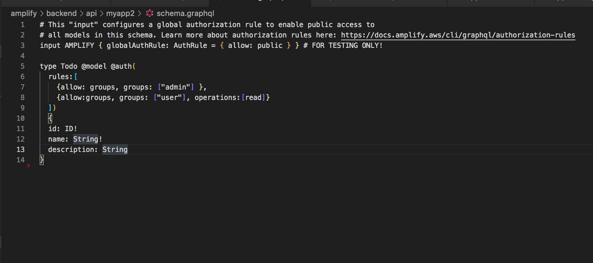

# [Install amplify](https://docs.amplify.aws/cli/start/install/)

`git checkout release`
`rm -rf amplify`
`npm install -g @aws-amplify/cli`

`amplify configure` 
###### region:  us-east-1
######  user name:  lehuuduyen-user
###### add permission : AdministratorAccess
###### Profile Name: appsync
`amplify init`

###### Enter a name for the project (appsyncaws) => {PROJECT NAME}

###### Initialize the project with the above configuration? : y

`amplify add api`

###### Select from one of the below mentioned services: GraphQL

###### Here is the GraphQL API that we will create. Select a setting to edit or continue Name: appsyncaws

###### Provide API name: appsyncaws

###### Here is the GraphQL API that we will create. Select a setting to edit or continue Continue

###### Choose a schema template: Single object with fields (e.g., “Todo” with ID, name, description)

###### Do you want to edit the schema now? (Y/n) · yes

###### Choose your default editor: Visual Studio Code

###### Try opening with system-default editor instead? No

`amplify add auth`

###### Do you want to use the default authentication and security configuration? Manual configuration

###### Select the authentication/authorization services that you want to use: User Sign-Up, Sign-In, connected with AWS IAM controls (Enables per-user Storage features for images or other content, Analytics, and more)

###### Provide a friendly name for your resource that will be used to label this category in the project: {ENTER}

###### Enter a name for your identity pool. {ENTER}

###### Allow unauthenticated logins? (Provides scoped down permissions that you can control via AWS IAM) No

###### Provide a name for your user pool: {ENTER}

###### How do you want users to be able to sign in? Username

###### Do you want to add User Pool Groups? Yes

###### Provide a name for your user pool group: admin

###### Do you want to add another User Pool Group Yes

###### Provide a name for your user pool group: user

###### Do you want to add another User Pool Group No

###### Sort the user pool groups in order of preference · admin, user

###### Do you want to add an admin queries API? No

###### Multifactor authentication (MFA) user login options: OFF

###### Email based user registration/forgot password: Enabled (Requires per-user email entry at registration)

###### Specify an email verification subject: {ENTER}

###### Specify an email verification message: {ENTER}

###### Do you want to override the default password policy for this User Pool? No

###### What attributes are required for signing up? Email

###### Specify the app's refresh token expiration period (in days): 30

###### Do you want to specify the user attributes this app can read and write? No

###### Do you want to enable any of the following capabilities? : {ENTER}

###### Do you want to use an OAuth flow? No

###### Do you want to configure Lambda Triggers for Cognito? No

`amplify push`
###### Do you want to generate code for your newly created GraphQL API Yes
###### Choose the code generation language target : angular
###### Enter the file name pattern of graphql queries, mutations and subscriptions: {ENTER}
###### Do you want to generate/update all possible GraphQL operations - queries, mutations and subscriptions: yes
###### Enter maximum statement depth [increase from default if your schema is deeply nested]: {ENTER}
###### Enter the file name for the generated code: {ENTER}

## Development server
Run `ng serve` for a dev server. Navigate to `http://localhost:4200/`. The app will automatically reload if you change any of the source files.

